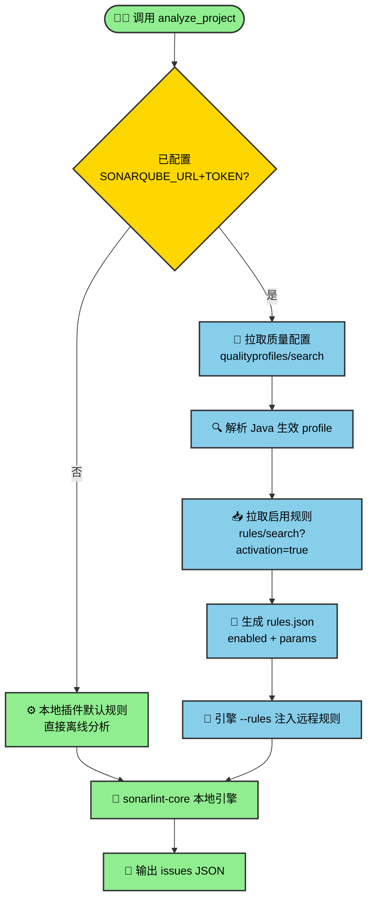
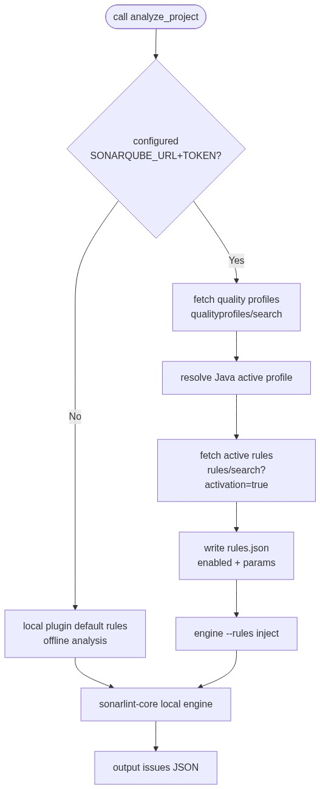

# sonar-local-mcp · 本地 Sonar MCP

通过 [MCP](https://modelcontextprotocol.io) 在 AI 客户端(Reasonix / Claude / Cursor 等)中调用**本地 Sonar 引擎**做 Java 代码审查。

零服务器、零驻留:引擎内嵌 `sonarlint-core`(与 SonarLint 插件同源,standalone 离线模式),要查才跑、跑完退出;所有分析在本地完成,代码不出本机。

## 特性

- **离线分析**:嵌入 `sonarlint-core 9.8` + `sonar-java-plugin`,无需任何服务端;
- **即用即走**:CLI 进程按需启动,无常驻守护进程;
- **返回体可控**:结果自动裁剪并支持分页,大项目也不会撑爆客户端导致 JSON 解析失败;
- **安全边界**:`get_source_code` 仅可读取最近一次分析的项目根目录内文件;
- **即席分析**:对代码片段直接跑引擎,不落盘项目;
- **可选远程规则**:配置 SonarQube 后,用服务端质量配置的规则做本地校验(见下)。

## 架构

```
AI 客户端 (Reasonix / Claude / Cursor)
        │  MCP (stdio, JSON-RPC)
        ▼
sonar_mcp_server.py (FastMCP) ──▶ reports/sonar-report.json + 内存缓存
        │  subprocess 调用
        ▼
sonar-local-mcp.jar (Java, 内嵌 sonarlint-core)
```

## 目录结构

```
sonar-local-mcp/
├── engine/                              # Java 引擎(内嵌 sonarlint-core)
│   ├── pom.xml                          # 构建配置
│   └── src/main/java/com/sonarlocal/SonarLocal.java
├── server/
│   ├── sonar_mcp_server.py              # MCP server(FastMCP, stdio)
│   ├── test_client.py                   # 协议往返回归测试
│   └── requirements.txt
├── reports/                             # 最近一次分析报告(运行时生成)
├── skills/sonar-local-mcp/             # 引导 skill(SKILL.md)
├── images/                              # 文档配图
├── LICENSE
└── README.md
```

## 快速开始

### 环境要求

| 组件 | 版本 | 说明 |
|---|---|---|
| JDK | **17+** | `sonarlint-core 9.8` 硬性要求 |
| Python | 3.10+ | 运行 MCP server |
| `mcp` SDK | ≥1.0 | `pip install -r server/requirements.txt` |
| Maven | 3.6+ | **仅源码构建时需要**;直接用预构建 jar 则不需要 |

### 安装(源码构建)

```powershell
cd engine
mvn -B package -DskipTests          # 产物: target/sonar-local-mcp-0.0.1.jar + target/plugins/
cd ../server
python -m pip install -r requirements.txt
```

MCP server 会自动发现 `engine/target/` 下最新的 jar,升级时直接替换即可,无需改代码。

### 快速验证

```powershell
cd server
python test_client.py --src <你的Java项目目录> --max-files 30 --java C:\path\to\jdk-17\bin\java.exe
```

覆盖:握手 → 工具列表 → 分析 → 过滤/分页 → 源码读取边界 → 片段即席分析。

### 命令行用法(不经 MCP)

```powershell
java -jar engine\target\sonar-local-mcp-0.0.1.jar --src <项目目录> [--out report.json] [--max-files N] [--rules rules.json]
```

- `--src` 必填;`--out` 不填则打印到 stdout;`--max-files 0` = 不限;`--rules` 指定规则覆盖文件(见"远程规则校验");
- 退出码:`0` 成功 / `2` 输入错误 / `1` 运行异常。

## MCP 工具

| 工具 | 参数 | 说明 |
|---|---|---|
| `analyze_project` | `project_path`(必填), `max_files=200`, `max_issues=500`, `severity=""`, `min_severity=""` | 离线分析项目,返回汇总 + issues(超限自动裁剪并附 `hint`) |
| `list_issues` | `severity=""`, `rule=""`, `min_severity=""`, `limit=100`, `offset=0` | 分页/过滤最近一次分析结果(limit 上限 500) |
| `get_source_code` | `file_path`(必填) | 读取项目根内源码(越界拒绝) |
| `analyze_code_snippet` | `code`(必填), `file_name="Snippet.java"` | 代码片段即席分析 |

### 严重级别筛选

两个工具都支持按严重级别过滤:

- `severity`:逗号分隔的级别集合,如 `"BLOCKER,CRITICAL,MAJOR"`;
- `min_severity`:最低级别,如 `"MAJOR"`(保留等于或更严重者);
- 两者可叠加,并与 `rule` 组合;`analyze_project` 过滤后 `total`/`summary` 只统计保留级别;
- 也可用环境变量 `SONAR_SEVERITY` / `SONAR_MIN_SEVERITY` 设为默认过滤,显式传参会覆盖。

### 远程规则校验(可选)

默认本地分析用引擎内嵌插件规则。配置 SonarQube(自建或 Cloud)后,server 会拉取该质量配置内启用的 Java 规则(含严重度/参数),注入本地引擎,使本地判定与远程质量配置一致;**不配置则用本地默认规则,行为不变**。



> 静态图(不支持 Mermaid 的平台):

**关键点**

- **定位 profile**:`SONARQUBE_PROFILE`(按名称/key,推荐)或 `SONARQUBE_PROJECT`(自动解析该项目默认 Java profile);
- **拉取规则**:`api/rules/search?qprofile=...&activation=true&languages=java&f=actives`,分页拉全启用规则及自定义参数值(如 `java:S110 max=5`);
- **本地生效**:引擎对 `StandaloneAnalysisConfiguration` 注入 `addIncludedRules`(启用)+ `addExcludedRules`(关闭其余)+ `addRuleParameters`;
- **版本差异**:远程比本地插件新的规则本地无实现,只取交集;
- **失败即报错**:配置了远程但拉取失败,返回结构化 `{"error":...}`,不静默回退,避免误判"用了远程规则"。

### 返回体与分页

所有工具返回体受 `SONAR_MAX_TEXT`(默认 12000 字符)保护,避免大 JSON 被客户端截断:

- `analyze_project` 返回 `total / shown / truncated / hint` + `summary`(bySeverity / byType / byRule);
- 完整明细用 `list_issues` 分页获取,`hint` 会给出下一页参数。

## 接入与配置

以 `.mcp.json`(或客户端对应配置)为例:

```json
{
  "mcpServers": {
    "sonar-local-mcp": {
      "command": "python",
      "args": ["<本仓库绝对路径>\\server\\sonar_mcp_server.py"],
      "env": { "SONAR_JAVA": "C:\\path\\to\\jdk-17\\bin\\java.exe" }
    }
  }
}
```

### 统一配置文件(推荐)

所有可配置项可集中放在一个 JSON 配置文件里(默认仓库根 `sonar-local-config.json`,可用环境变量 `SONAR_CONFIG` 指定其它路径),复制 `sonar-local-config.example.json` 即可;真实配置含 token 被 gitignore,不入库。**优先级:环境变量 > 配置文件 > 默认值**。

```json
{
  "sonar_java": "C:\\path\\to\\jdk-17\\bin\\java.exe",
  "timeout_seconds": 900,
  "max_text_chars": 12000,
  "remote_rules_ttl_seconds": 900,
  "severity": "BLOCKER,CRITICAL,MAJOR",
  "min_severity": "",
  "sonarqube": {
    "url": "http://<host>:9000",
    "token": "sqa_xxx",
    "profile": "aws-java",
    "project": ""
  }
}
```

- `severity` / `min_severity`:输出规则的严重级别过滤(也支持数组 `["BLOCKER","CRITICAL","MAJOR"]`);
- `sonarqube` 段:配置规则服务器(远程 SonarQube),开启"用远程质量配置规则做本地校验";不填则用本地默认规则;
- `remote_rules_ttl_seconds`:远程规则拉取结果的缓存时长(秒,默认 900),避免每次分析都重复请求 SonarQube;质量配置若要立即生效可调小或重启 server;
- 所有字段均可空,也可用同名环境变量代替(此时 env 优先)。

### 环境变量

| 变量 | 默认值 | 说明 |
|---|---|---|
| `SONAR_CONFIG` | `sonar-local-config.json`(仓库根) | 统一配置文件路径(见上) |
| `SONAR_JAVA` | `java`(PATH 查找) | JDK 17+ 的 `java` 可执行文件路径 |
| `SONAR_TIMEOUT` | `900` | 单次分析超时(秒) |
| `SONAR_MAX_TEXT` | `12000` | 单个工具返回体最大字符数 |
| `SONAR_SEVERITY` | 空(不过滤) | 默认严重级别集合(逗号分隔) |
| `SONAR_MIN_SEVERITY` | 空(不过滤) | 默认最低严重级别 |
| `SONARQUBE_URL` | 空(不启用) | 远程 SonarQube 地址(自建或 Cloud),如 `http://<host>:9000` |
| `SONARQUBE_TOKEN` | 空(不启用) | 远程 SonarQube 访问 token |
| `SONARQUBE_PROFILE` | 空 | 质量配置名称/key(推荐) |
| `SONARQUBE_PROJECT` | 空 | 项目 key(非本机路径),自动解析其默认 Java profile |

远程规则校验示例(自建 SonarQube):

```json
{
  "mcpServers": {
    "sonar-local-mcp": {
      "command": "python",
      "args": ["<本仓库绝对路径>\\server\\sonar_mcp_server.py"],
      "env": {
        "SONARQUBE_URL": "http://<host>:9000",
        "SONARQUBE_TOKEN": "sqa_xxxxxxxxxxxxxxxxxxxxxxxx",
        "SONARQUBE_PROFILE": "aws-java"
      }
    }
  }
}
```

## 引导 skill

`skills/sonar-local-mcp/` 是通用的 agent 引导 skill(SKILL.md + agents 接口清单),不限于某一客户端:装到任何支持 skills 的 agent 的 skills 目录(如 `~/.codex/skills/`、pi、Claude Code 等)即可自动被发现。它负责教 agent 何时用哪个工具、结果截断时怎么翻页、有哪些坑。

```powershell
Copy-Item -Recurse skills\sonar-local-mcp <你的skill目录>\
```

## 安全与边界

- **路径边界**:`get_source_code` 的绝对路径必须位于最近一次分析的项目根目录内(`Path.resolve()` 后校验),相对路径仅按项目根解析;
- **文件名防逃逸**:`analyze_code_snippet` 的 `file_name` 只取 basename 并强制 `.java` 后缀;
- **大小边界**:返回体受 `SONAR_MAX_TEXT` 控制;代码片段上限 1 MB;
- **错误可读**:路径不存在、jar 未构建、JDK 缺失、报告损坏等可预期错误一律返回结构化 `{"error":...}`,不抛调用异常。

## 常见问题

**Q: 提示 `sonar-local-mcp.jar not found`?**
A: 引擎未构建。`cd engine && mvn -B package -DskipTests`(需 JDK 17 + Maven),或用预构建 jar 放入 `engine/target/`。

**Q: 提示 Java launcher not found / 引擎启动失败?**
A: 默认 `java` 不是 JDK 17,用 `SONAR_JAVA` 指向 JDK 17+ 的 `java.exe`。

**Q: 分析大项目很慢?**
A: 首次需加载插件(数秒)+ 解析全部 `.java`。用 `max_files` 限制,或调大 `SONAR_TIMEOUT`。

**Q: issues 被裁剪了?**
A: 设计行为。按 `hint` 用 `list_issues(offset=..., limit=...)` 分页取,可按严重级别/规则过滤。

## 实现说明(踩坑)

1. 官方 `sonarlint-cli` 已归档(2018)且无稳定分发 → 直接嵌入 `sonarlint-core` 引擎;
2. `sonarlint-core 10.x+` 改为 RPC backend 架构、嵌入过重 → 锁定 **9.8 legacy API**(`StandaloneSonarLintEngineImpl`);
3. 必须 `addEnabledLanguage(Language.JAVA)`,否则插件 `skip=LanguagesNotEnabled`,0 条规则;
4. `sonar-java-plugin` 需以**独立 jar 文件**加载(`addPlugin(Path)`),不能打进 fat jar → 构建时 `maven-dependency-plugin` 复制到 `target/plugins/`;
5. `ClientInputFile` 需实现全部抽象方法(含 `contents()` / `inputStream()` / `getClientObject()`);
6. MCP server 用 `_find_jar()` 自动发现最新 jar,升级无需改代码。

## 许可证与第三方组件

本项目自身代码以 [MIT](LICENSE) 发布。

本项目嵌入并重新分发以下 **LGPL-3.0** 组件,请遵循其许可条款:

| 组件 | 许可证 | 分发方式 |
|---|---|---|
| `sonarlint-core` | **LGPL-3.0** | 打进 fat jar(maven-shade 合并) |
| `sonar-java-plugin` | **LGPL-3.0** | 独立 jar,`addPlugin` 加载 |

- 完整第三方许可声明见 [THIRD_PARTY_NOTICES.md](THIRD_PARTY_NOTICES.md);LGPL-3.0 副本见 [LICENSES/LGPL-3.0.txt](LICENSES/LGPL-3.0.txt);
- 上述文本也已打进 `engine/target/sonar-local-mcp-*.jar` 的 `META-INF/`,随分发携带;
- 若对外分发,请保留许可声明与版权声明;LGPL-3.0 要求允许以源码重链接,本项目 `mvn package` 即可用 pom 声明的 LGPL 源码重建 jar。